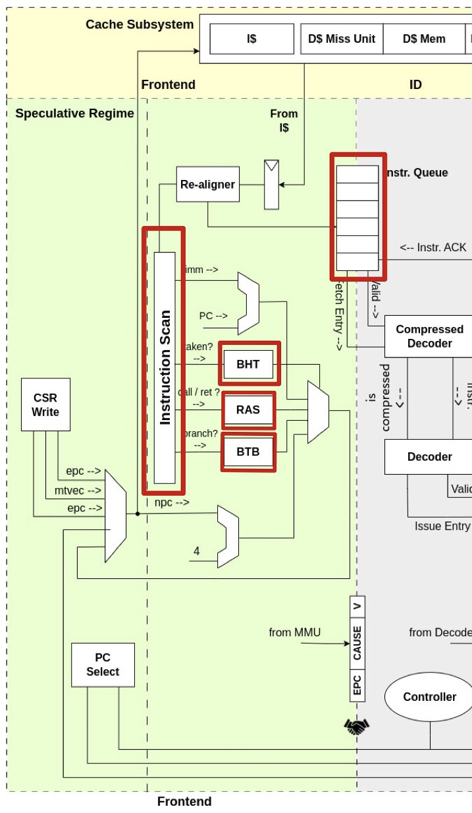

# Development of detailed records

## Table of Contents
- [Project Overview](#project-overview)
- [Team Members](#team-members)
- [Introduction to CVA6](#introduction-to-cva6)
- [Code analysis](#code-analysis)
  - [core](#core)
    - [frontend](#frontend)
    - [ID](#id)
    - [Issue](#issue)
    - [Excute](#excute)  
    - [cache_subsystem](#cache_subsystem)
  - [sw](#sw)
    - [app](#app)

## Project Overview
- 4th national RISC-V student contest 2023-2024 in France
- Accelerating AI applications on a RISC-V processor
- The works of Dragon core

## Team Members
- Liu Jingze  
- Zhang Yalei  
- Sun Yongxin  

## Introduction to CVA6
CVA6 is a high-performance processor design that supports out-of-order and in-order execution. It is capable of handling advanced features such as branch prediction, instruction reordering, exception handling, and virtual memory support.

## Code Analysis

### core
The code implementation and functionalities of the folder 'core' are described in detail.

#### frontend 

- instr_realign.sv：Adjusts the instruction stream to ensure that instructions are aligned properly for decoding.  

The frontend folder is related to the Front End and Instruction Decode (ID) stages.
- bht.sv: BHT (Branch History Table) predicts the direction of branch instructions to enhance instruction flow.
- ras.sv:The RAS (Return Address Stack) is a data structure used in processor design for storing and restoring return addresses of function calls.
- btb.sv: BTB (Branch Target Buffer) caches the destination of recently executed branch instructions to speed up branch instruction execution.
- instr_scan.sv: Responsible for scanning, identifying, and handling instructions entering the decode phase.
- instr_queue.sv: Instruction Queue stores instructions waiting to be processed.Buffers instructions before they are issued to ensure a steady flow to the execution units.
- fronted.sv: Defines the module interface and instances of some internal submodules.

#### ID
- compressed_decoder.sv:Decodes compressed instructions into their full-sized counterparts if the processor supports compressed instruction sets.
- decoder.sv:Translates binary instruction codes into a set of control signals for the execution units.

#### Issue
- issue_read_operands.sv：The "Issue Read" stage dispatches ready instructions with their operands to the execution units.

#### Excute
- alu.sv:ALU (Arithmetic Logic Unit) performs arithmetic and logical operations.
- csr_buffer.sv:Temporarily holds the results of CSR operations before they are written back to the registers.

#### cache_subsystem

- The cache_subsystem part is the processor's cache subsystem, managing and providing fast data access to the CPU. It usually includes the Instruction Cache (I-Cache) and Data Cache (D-Cache) for caching instructions and data, respectively, reducing the number of times the processor accesses the main memory, thus improving efficiency.
- wt_dcache_ctrl.sv: DS Controller controls the data cache logic, including cache coherence, read/write requests, etc.
- wt_dcache_mem.sv: DS Mem represents the memory interface of the data cache, managing data exchanges between the data cache and main memory or other cache levels.
- wt_dcache_missunit.sv: DS Miss Unit handles misses when the processor tries to read data from the data cache but does not find it, possibly requiring fetching data from the main memory or a lower cache level.
- wt_dcache_wbuffer.sv: DS Buffer, a buffer used to optimize data write operations. Data may be written first into this buffer when it can't be written to the cache immediately.
- wt_dcache.sv:
- wt_dcache_subsystem.sv: Manages the logic of instruction and data cache and the adapter logic to the memory interface. With a parametric design, it can adapt to different configurations and memory system interfaces.

### sw
#### app
mnist：Information about neural networks.
